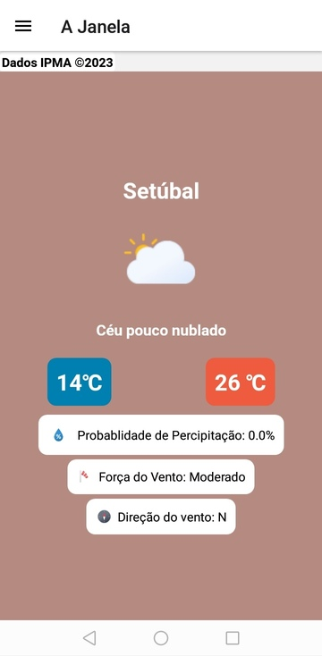

# Janela Aberta

An extremly simple app to check the current weather in all the district capitals in Portugal, [using the IPMA API](https://api.ipma.pt).

It’s basically my playground to practice React Native stuff.

## Todo List

* [ ] Clean up the settings screen/styles in general
* [ ] Add Weather Warning Support
* [ ] Localization Support

### External art credit

This app uses the really [cool weather icon set by basmilius](https://github.com/basmilius/weather-icons).

